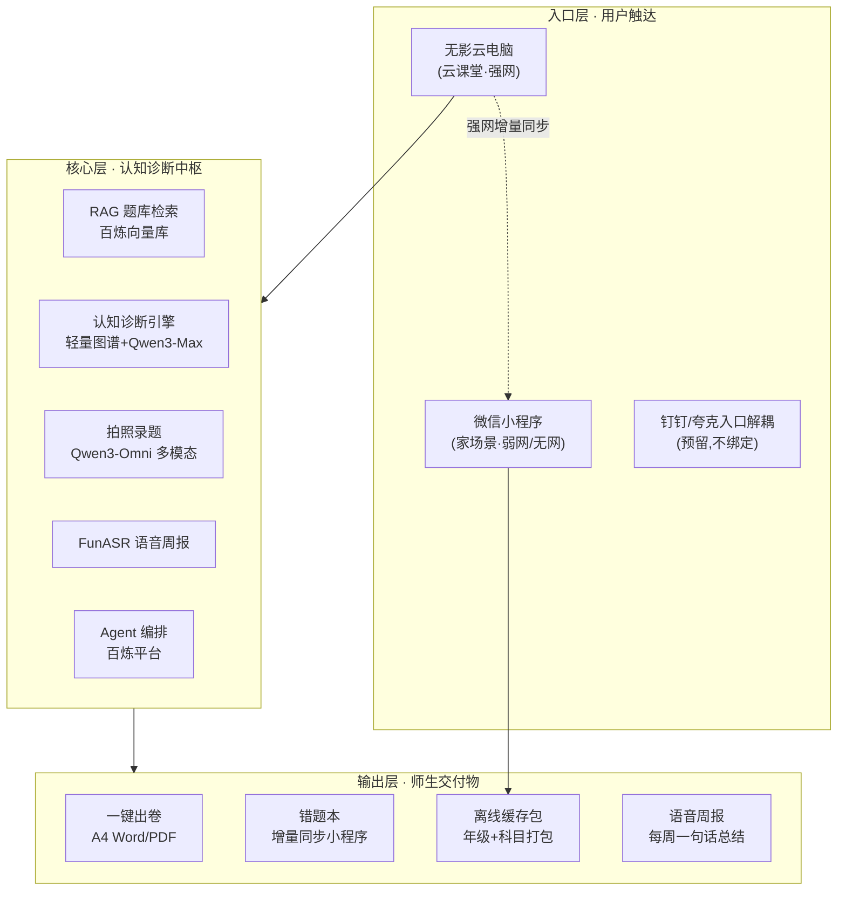
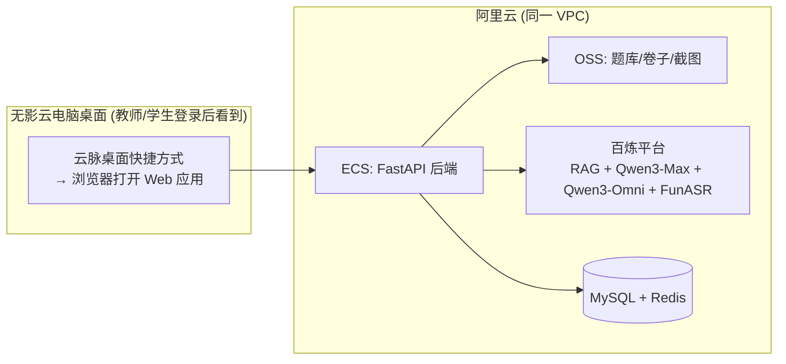
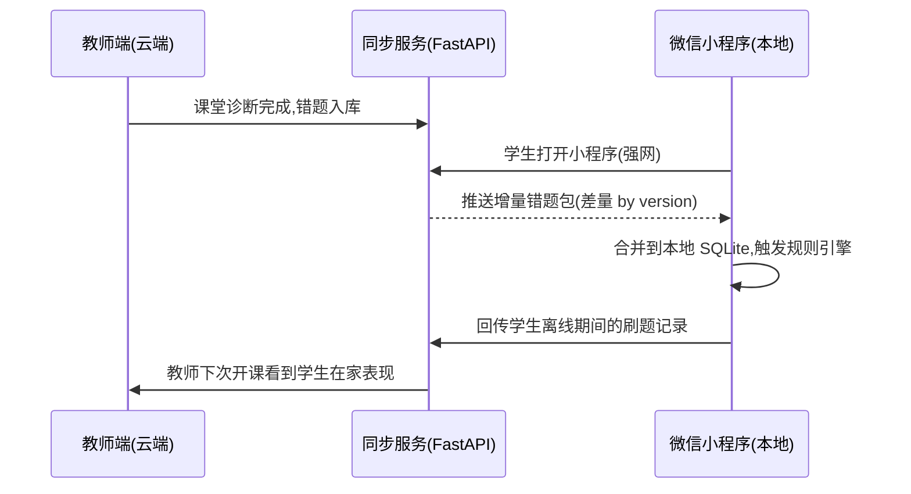

# 云脉·智诊伴学 · 双轨制产品架构

> Slogan：夸克解题，钉钉批改，云脉智诊——做乡村师生身边的AI认知教研员。
> 核心定位：不造轮子，不抢入口，做阿里教育生态中缺失的"认知诊断与补漏中枢"。
> MVP 范围：初中数学七年级上册，约 50 个核心知识点。

## 一、为什么必须"双轨制"

云脉服务的乡村课堂有个绕不开的硬件事实：无影云电脑靠云端算力，**断网即黑屏**，教室里只要网一抖，整堂课就得停下来。而学生回家后，家里多半是手机流量加断断续续的 WiFi，指望他们在小程序里实时调大模型推理，既不现实也不经济。

所以云脉从一开始就**不做"一套代码两套皮"的伪双端**，而是把两条场景链路明确分开：

- **云课堂轨**：强网环境，无影云电脑 + 云端 Qwen3-Max，做重活——拍照录题、认知诊断、一键出卷、语音周报。
- **家场景轨**：弱网/无网环境，微信小程序 + 本地规则引擎，做轻活——错题回顾、离线刷题、规则式补漏推荐。

两条轨在"强网窗口期"做一次增量同步：云端的错题本和诊断结果落到小程序本地，断网时学生照样能复盘。

## 二、总体架构图（三层结构）

### 2.1 三层架构总览



### 2.2 三层职责一句话

| 层 | 职责 | 关键约束 |
|---|---|---|
| 入口层 | 把教师和学生接到合适的算力上 | 入口与夸克/钉钉解耦，重度绑定百炼 |
| 核心层 | 跑认知诊断、题库检索、多模态识别 | LLM 只解析不生成题目 |
| 输出层 | 产出老师能直接打印、学生能离线用的东西 | A4 卷子是第一交付物 |

## 三、双轨制场景对照表

| 维度 | 云课堂轨 | 家场景轨 |
|---|---|---|
| **典型用户** | 教师主导，学生课上用无影终端 | 学生独立刷题，家长在旁辅导 |
| **承载设备** | 无影云电脑（瘦客户端 + 云端算力） | 家长/学生手机上的微信小程序 |
| **算力部署** | 云端 Qwen3-Max / Qwen3-Omni / FunASR，本地零算力 | 本地规则引擎 + 缓存题包，无大模型调用 |
| **核心功能** | 拍照录题、认知诊断、一键出卷、语音周报、教师批改辅助 | 错题回顾、离线刷题、规则式补漏推荐、拍照暂存待同步 |
| **网络要求** | 强网（学校专线或稳定 4G/5G），断网即停服 | 弱网可降级运行，无网仍可刷错题 |
| **主要交付物** | A4 Word/PDF 卷子、解析册、语音周报 | 离线题包、错题本快照、本地推荐清单 |
| **数据流向** | 教师操作 → 云端诊断 → 出卷 + 错题入库 | 学生复习 → 本地错题 → 强网时回传增量 |
| **同步策略** | 强网窗口主动推送给绑定小程序 | 收到推送后增量合并到本地缓存 |

## 四、部署架构

### 4.1 无影云电脑侧 · SaaS 预装模式

无影云电脑本身**没有端侧 GPU/大模型算力**，它只是个"显示器 + 浏览器"。所以云课堂侧本质是 SaaS 预装：



要点：
- 无影侧不部署任何模型，全部走内网调百炼平台 API，延迟低、不走公网流量。
- 教师桌面预装一个快捷方式，点开就是 Web 应用，零安装。
- 卷子产物（Word/PDF）落到 OSS，教师可一键下载打印或扫码传手机。

### 4.2 微信小程序侧 · 本地缓存 + 规则引擎

小程序侧的硬约束是**包体积 <50MB、断网可用**：

| 缓存类型 | 内容 | 体积预算 | 更新策略 |
|---|---|---|---|
| 题包 | 真题图片 + 核心文本（不含解析全文） | 单包 5-10MB，按"年级+科目"打包 | 强网时按版本号增量下载 |
| 错题本 | 学生错题 ID + 错因标签 + 推荐题 ID | <5MB | 云端推送增量合并 |
| 规则引擎 | 50 个知识点的补漏规则 JSON | <1MB | 随版本发布 |
| 解析全文 | 按需懒加载，不进本地 | 0 | 用到时在线拉 |

规则引擎做的是"轻诊断"：学生离线刷错题时，按预置规则（如"一元一次方程解错 3 次 → 推荐基础题 5 道"）给出推荐，不调大模型。

### 4.3 数据同步 · 强网窗口增量同步



同步设计要点：
- **版本号差量**：每个错题/题包带 `version` 字段，客户端只拉 `local_version` 之后的增量，避免全量重下。
- **冲突以云端为准**：学生离线期间的本地刷题记录只读不写库，回传后由云端合并去重。
- **同步只在强网触发**：小程序进入弱网/无网时直接走本地，不卡在 loading。

## 五、技术栈选型表

| 类别 | 选型 | 选型理由 |
|---|---|---|
| 云课堂前端 | Vue3 + TypeScript + KaTeX | 无影内置浏览器兼容好；KaTeX 渲染快、体积小，断网不崩 |
| 家场景前端 | 微信小程序原生（非 uni-app） | 原生包体最小、缓存可控、不背框架运行时包袱 |
| 后端服务 | Python 3.11 + FastAPI | 与 python-docx/ReportLab、百炼 SDK 同生态，异步友好 |
| 关系数据库 | MySQL 8.0 | 题库/错题/用户结构化数据 |
| 缓存 | Redis 7 | 会话、出卷任务队列、热点题索引 |
| 向量库 | 百炼平台内置向量库 | 不自建 Milvus，省运维、与 RAG 一体化 |
| 多模态识别 | Qwen3-Omni（百炼） | 拍照录题，识别手写 + 印刷题干 |
| 主推理模型 | Qwen3-Max（百炼） | 解析、诊断、变式思路，最强档 |
| 语音合成/识别 | FunASR（百炼） | 教师语音周报、家长方言朗读 |
| 出卷排版 | python-docx + ReportLab | Word 走 docx，PDF 走 ReportLab，A4 标准版式 |
| 公式渲染 | KaTeX 0.16 | 比 MathJax 轻、SSR 友好 |
| 部署 | 阿里云 ECS + OSS + 无影 | 赛道生态统一，评委一眼看清成本结构 |
| CI/CD | 云效流水线 | 同属阿里云，免额外账号 |

## 六、关键模块边界

### 6.1 拍照录题（Qwen3-Omni 多模态识别）

- **输入**：教师/学生手机或无影摄像头拍的题目图片。
- **输出**：结构化题干（含 LaTeX 公式）+ 题型标签 + 难度初判。
- **边界**：只识别，**不解题**。识别结果落库前必须经教师确认，避免脏数据污染题库。
- **降级**：识别置信度 < 0.8 → 保留原图，标"待人工录入"，不强入库。

### 6.2 认知诊断引擎（轻量图谱 + Qwen3-Max Prompt 推理）

- **输入**：学生错题集合 + 知识点图谱（50 节点，预置）。
- **输出**：知识点掌握度热力图 + 薄弱点 Top3 + 推荐补漏路径。
- **边界**：图谱是**预置静态**的（七年级上册 50 个点），不让 LLM 现场生成图谱结构；LLM 只在给定图谱上做推理打分。
- **降级**：百炼调用失败 → 退化为规则引擎打分（错题数/总题数），保证出卷不中断。

### 6.3 RAG 题库检索（百炼向量库）

- **输入**：薄弱点 + 难度区间 + 题型。
- **输出**：候选真题列表（带来源、难度、答案）。
- **边界**：**所有题目来自真题库检索**，LLM 绝对禁止凭空生成题干。LLM 只能改写题面表述做变式，且变式必须保留原题锚点。
- **降级**：向量检索为空 → 回退到知识点标签匹配的默认题库子集，绝不让"无题可出"。

### 6.4 一键出卷（python-docx / ReportLab 排版）

- **输入**：教师选定的知识点 + 难度 + 题量。
- **输出**：A4 Word（可二次编辑）+ PDF（直接打印）+ 解析册。
- **边界**：版式严格 A4，字号/行距按考试规范；公式用 OMML（Word）或 LaTeX→图（PDF）。
- **降级**：某题 LaTeX 解析失败 → 该题降级为纯文本或原图截图占位，卷子照常出，绝不整卷失败。

### 6.5 FunASR 语音周报

- **输入**：本周班级/学生诊断摘要文本。
- **输出**：1 分钟以内语音 + 文字稿，可发到家长群。
- **边界**：只做摘要朗读，不做实时对话；方言支持按需开启。
- **降级**：ASR/TTS 失败 → 只发文字稿，不阻塞周报流程。

### 6.6 离线缓存包（按"年级+科目"打包）

- **输入**：年级 + 科目 + 版本号。
- **输出**：`.ympack` 压缩包（图片 + 核心文本 + 规则 JSON）。
- **边界**：单包 ≤10MB，不打包解析全文、不打包大模型权重；学生用到解析时在线拉。
- **降级**：包下载失败 → 保留上一版本本地包，提示"内容稍旧"。

## 七、防幻觉与鲁棒性设计

云脉面对的是乡村课堂，**老师没时间修 Bug，学生断网就停课**。鲁棒性是架构底线，不是可选项。

### 7.1 防幻觉四道闸

| 闸口 | 做法 | 兜底 |
|---|---|---|
| 题目来源 | 100% 来自 RAG 真题库检索 | 检索空 → 默认题库子集 |
| LLM 职责 | 只做解析/诊断/变式思路，不生成题干 | 越界输出 → 拒绝入库 |
| 图谱结构 | 预置静态图谱，LLM 不改结构 | LLM 失败 → 规则引擎打分 |
| 公式渲染 | LaTeX 解析失败降级 | 纯文本或原题截图 |

### 7.2 鲁棒性代码模式

- **所有外部调用 try-except + 有限重试**：百炼 API、OSS、向量库调用统一包一层 `retry(3, backoff=exponential)`，重试耗尽走兜底分支。
- **默认推荐题库兜底**：每个知识点预置 5 道"保底题"，任何上游异常都保证出卷有题。
- **LaTeX 渲染降级链**：`KaTeX 渲染 → 失败 → 纯文本去公式符 → 失败 → 原题截图`，三层降级，页面永不白屏。
- **离线模式开关**：小程序检测到弱网（RTT > 800ms 或丢包）自动切本地规则引擎，不卡 loading。
- **出卷任务幂等**：同一教师同一参数 5 分钟内重复出卷，直接返回上次结果，避免重复消耗百炼额度。

### 7.3 降级伪代码示意

```python
def render_question(question) -> RenderResult:
    # 第一层：KaTeX 正常渲染
    try:
        return katex_render(question.latex)
    except LatexParseError:
        pass
    # 第二层：纯文本去公式符
    try:
        return plain_text(strip_latex(question.latex))
    except Exception:
        pass
    # 第三层：原题截图占位，绝不抛白屏
    return image_fallback(question.image_url, note="公式降级为原图")
```

### 7.4 失败可见

- 教师端任何降级行为都在卷子/报告上**显式标注**（如"本题公式降级为纯文本"），不让老师拿着残缺卷子去上课还不知道。

## 八、目录结构建议

```
knowtrace/
├── src/
│   ├── server/              # FastAPI 后端
│   │   ├── api/             # 路由：录题/诊断/出卷/同步
│   │   ├── core/            # 业务编排：诊断引擎、出卷流水线
│   │   ├── rag/             # 百炼向量库检索封装
│   │   ├── models/          # ORM 模型
│   │   └── prompts/         # 各模块 Prompt 模板（运行时加载）
│   ├── miniprogram/         # 微信小程序原生代码
│   │   ├── pages/
│   │   ├── engine/          # 本地规则引擎
│   │   └── store/           # 本地缓存读写
│   ├── web/                 # 云课堂 Web 前端（Vue3）
│   │   ├── views/
│   │   ├── components/
│   │   └── katex/           # 公式渲染与降级封装
│   └── shared/              # 前后端共享 schema/枚举/规则
├── data/
│   ├── question_bank/       # 真题库（题干+答案+来源+向量）
│   ├── graph/               # 50 知识点静态图谱 JSON
│   └── offline_pack/        # 离线缓存包构建产物（不进版本库）
├── content/
│   ├── textbook/            # 七年级上册知识点拆解（Markdown）
│   └── default_quiz/        # 每知识点 5 道保底题
├── docs/                       # 设计文档（当前骨架已落地 00-07 共 8 份，见项目根 README）
│   ├── 00-项目定位与阿里生态对接.md
│   ├── 01-双轨制产品架构.md    # 本文档
│   ├── 02-知识图谱与认知诊断.md
│   ├── 03-RAG题库与防幻觉.md
│   ├── 04-百炼平台技术集成.md
│   ├── 05-MVP四周冲刺.md
│   ├── 06-演示剧本与Checklist.md
│   └── 07-工程化资产复用说明.md
├── scripts/
│   ├── build_offline_pack.py   # 打离线包
│   ├── sync_question_bank.py   # 题库入库 + 向量化
│   └── check_paper_layout.py   # 卷子版式校验
├── tests/
└── deploy/
    ├── wyun/                # 无影 SaaS 预装脚本
    └── terraform/           # 阿里云资源编排
```

约定：
- `src/shared/` 放前后端共用的 schema 和规则，避免小程序和后端各写一份规则导致诊断不一致。
- `data/` 只放数据文件，不放代码；`offline_pack/` 是构建产物，不进版本库（用 `.gitignore` 屏蔽大文件）。
- `content/` 放"人写的内容"（知识点拆解、保底题），`data/` 放"机器维护的数据"（向量、错题）。

## 九、评审视角加分点

1. **双轨制不是口号，是硬件事实逼出来的**——无影断网即黑屏这条约束贯穿全文，评委能看到我们是"先认账再设计"，而不是事后补的差异化叙事。

2. **防幻觉做成架构约束，而不是 Prompt 技巧**——题目来源、LLM 职责、图谱结构、公式渲染四道闸都是硬边界，比"在 Prompt 里写'请不要编造'"可靠得多，可演示、可断言。

3. **教师第一交付物是 A4 卷子，不是看板**——乡村老师打印机比投影仪靠谱，出卷链路从设计就奔着"下载即打印"去，落地性强。

4. **入口与夸克/钉钉解耦，重度绑定百炼**——既不因比赛拿不到官方 API 而卡死，又把成本和生态讲清楚，评委一眼看清"这团队知道自己在哪个生态里活"。

5. **离线缓存包按"年级+科目"打包，单包 ≤10MB**——这是 MVP 范围（七年级上册）和弱网现实共同推出的工程取舍，既不过度设计通用引擎，也不让乡村网络背锅。
