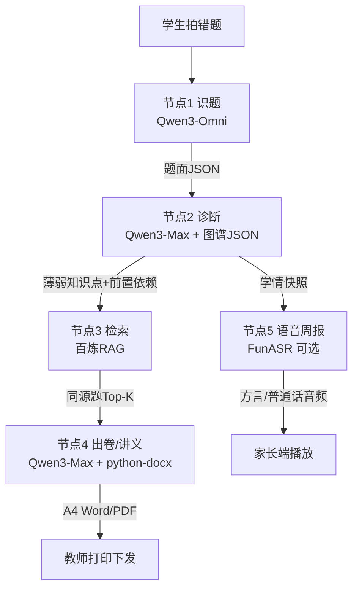

# 百炼平台技术集成方案

> 本文档面向「云脉·智诊伴学」项目（以下简称"云脉"），定位为阿里巴巴少年云助学计划·乡村课堂AI助教赛道的技术集成总方案。核心战略一句话：**重度使用百炼平台 RAG/Agent + Qwen3 系列 + FunASR + 无影云**，让评委第一反应是"百炼真好用，通义真强大"。

---

## 一、阿里生态能力映射表

下表把每一项阿里能力对到云脉的具体功能点上，并标注"评委视角为什么加分"。这张表是后面所有章节的总纲，评委翻文档时第一眼就能看到生态浓度。

| 阿里能力 | 在云脉的具体应用 | 评委视角加分点 |
|---|---|---|
| **Qwen3-Omni**（多模态） | 学生手机拍错题，Omni 识别手写公式、图形题、批改痕迹，输出结构化题面 JSON | 不只是 OCR 文字，是"看懂孩子写的什么"，证明通义多模态在真实乡村场景落地 |
| **Qwen3-Max**（最强推理） | 认知诊断推理（基于图谱 JSON 做 LCA 溯源）、出卷排版、教研讲义生成 | 把最贵的模型用在"诊断+教研"这种高价值环节，体现"会用模型"而非"乱用模型" |
| **阿里云百炼 RAG** | 5000 道初中数学真题向量库检索，出题/讲义题源全部来自 RAG 命中 | **防幻觉的关键证据**——出题靠检索真题，绝不靠 LLM 凭空生成，回应"大模型出数学题翻车"质疑 |
| **阿里云百炼 Agent** | 编排"识题→诊断→检索→排版→语音周报"全链路工作流，节点可插拔 | 证明百炼 Agent 不是 demo 玩具，是能跑真实教学闭环的编排平台 |
| **FunASR**（语音） | 留守儿童监护人（多为不识字祖辈）的学情周报，方言/普通话双模播报 | **公益温度的直接载体**——评委一听就懂"乡村"二字的分量，技术+人文双加分 |
| **无影云电脑** | SaaS 预装部署载体，系统装在少年云无影云桌面，学校一根网线一块屏即用 | **直接对上出题方（ATH+少年云）的利益**，评委里有少年云的人，等于"自己人站台" |

> 一句话总结这张表：六个能力不是堆叠，是**串成一条乡村教学闭环**——拍题(Omni)→诊断(Max)→找题(RAG)→出卷(Max+docx)→播报(FunASR)→落地(无影云)。

---

## 二、百炼 RAG 应用搭建步骤

### 2.1 数据导入：5000 道初中数学真题，结构化字段

**数据来源**：人教版/北师大版/苏教版三套教材配套真题 + 各省中考真题近 5 年 + 开源题库清洗。版权层面只入库题面与知识点标签，不存第三方教辅原文。

**结构化字段设计**（每道题一条 JSON）：

```json
{
  "problem_id": "JUNIOR-MATH-00001",
  "grade": "八年级",
  "semester": "上",
  "textbook_edition": "人教版",
  "chapter": "一元一次方程",
  "knowledge_points": ["方程概念", "移项", "合并同类项"],
  "difficulty": 0.45,
  "problem_type": "选择题",
  "stem": "下列式子中是一元一次方程的是（  ）...",
  "options": {"A":"...", "B":"...", "C":"...", "D":"..."},
  "answer": "B",
  "solution_steps": ["...", "..."],
  "cognitive_level": "理解",
  "source": "2024年某省中考改编",
  "image_refs": []
}
```

**入库流程**：
1. 原始题库 Excel/PDF → `scripts/parse_problems.py` 清洗 → 统一 JSON
2. 人工抽检 5%（≥250 道）校对知识点标签，错标率压到 3% 以下
3. 上传百炼数据中心，按 `chapter` + `difficulty` 建二级分类

### 2.2 Embedding 选型

百炼平台当前可用的通义系列 Embedding 模型选型对比：

| 模型 | 维度 | 中文效果 | 适用场景 |
|---|---|---|---|
| `text-embedding-v3` | 1024 | 优秀 | **主选**，数学题面+知识点混合检索 |
| `text-embedding-v2` | 1536 | 良好 | 兼容旧索引时备用 |

**选型理由**：v3 在中文语义检索上比 v2 提升明显，且 1024 维存储成本更低。数学题面有大量符号与短文本，v3 对短文本的稠密表征更稳。

**混合检索策略**：稠密向量（语义）+ BM25（关键词，如"二次函数""动点"）双路召回，百炼 RAG 应用内可直接配置 Rerank 模型（`gte-rerank`）做二次精排，Top-3 命中率目标 ≥ 90%。

### 2.3 向量库创建

1. 在百炼控制台 → 知识库 → 新建，命名 `cloudpulse_junior_math_v1`
2. 切片策略：**按 problem_id 整题切片**（不切段，保证一道题原子性），单条 chunk = 一道题完整 JSON
3. 索引字段：`chapter`、`difficulty`、`cognitive_level`、`textbook_edition` 作为结构化过滤字段，检索时可带 filter
4. 向量字段：`stem` + `knowledge_points` 拼接后做 embedding
5. 元数据保留：`answer`、`solution_steps` 不进向量，只在命中后回填

### 2.4 检索测试与准确率调优

**测试集**：从 5000 题里抽出 200 题作为查询样本（每题用"题面摘要+目标知识点"构造 query），人工标注期望命中的同源题集。

**调优指标**：

| 指标 | 目标值 | 调优手段 |
|---|---|---|
| Top-1 命中率 | ≥ 75% | 调 Rerank 模型权重 |
| Top-3 命中率 | ≥ 90% | 调召回数量（k=10→20） |
| 同知识点召回率 | ≥ 95% | 调 chunk 拼接策略，知识点字段加权 |
| 跨难度误召回率 | ≤ 5% | 加 `difficulty` 过滤，±0.2 容差 |

**调优闭环**：每周跑一次 `scripts/eval_rag_recall.py`，输出 miss case 列表，人工分析后调整 embedding 字段拼接或 rerank 阈值。这个动作本身也是评委加分点——证明团队有"RAG 不是建完就完，要持续调"的工程意识。

---

## 三、百炼 Agent 工作流编排

云脉主链路用一个百炼 Agent 串起五个节点，节点之间通过 JSON 上下文传递，每个节点可独立替换（比如识题节点从 Omni 换成纯 OCR 也能跑）。

### 3.1 工作流图



ASCII 备用版（防 mermaid 不渲染）：

```
[拍题] → (节点1 识题 Omni)
            ↓ 题面JSON
       (节点2 诊断 Max+图谱) ──→ 学情快照 → (节点5 语音周报 FunASR) → 家长
            ↓ 薄弱点+前置依赖                         ↑
       (节点3 检索 RAG)                               |
            ↓ 同源题 Top-K                            |
       (节点4 出卷 Max+docx) → A4 Word → 教师打印 ────┘
```

### 3.2 节点1：识题（Qwen3-Omni）

- **输入**：手机拍照图（JPEG）
- **Omni 提示词要点**：要求输出严格 JSON，字段含 `stem`、`options`、`image_type`（几何图/函数图/无图）、`handwriting_confidence`
- **输出**：题面 JSON，传给节点2
- **兜底**：Omni 置信度 < 0.7 时，触发"人工二次确认"分支，不强行往下走（防幻觉从源头掐住）

### 3.3 节点2：诊断（Qwen3-Max + 图谱JSON）

- **输入**：题面 JSON + 学生历史学情
- **图谱 JSON**：本地维护的初中数学知识图谱（约 380 个节点，1200 条边），存为 `data/math_graph.json`，节点含 `predecessors`（前置依赖）字段
- **Max 提示词要点**：
  1. 先判断这道题考了哪些知识点
  2. 对每个知识点，从图谱里查 LCA（最近公共祖先）路径，溯源到最底层前置薄弱点
  3. 输出 `diagnosis`：当前错因 + 溯源前置薄弱点列表 + 推荐补救难度梯度
- **输出**：诊断 JSON，传给节点3
- **关键设计**：诊断结果**不是 LLM 自由发挥**，是基于图谱 JSON 的结构化推理，Max 只做"读图+解释"，降低幻觉

### 3.4 节点3：检索（RAG）

- **输入**：诊断 JSON 里的"薄弱知识点 + 目标难度"
- **动作**：调用百炼 RAG，带 `chapter` + `difficulty` filter，召回 Top-10，Rerank 取 Top-5
- **输出**：同源题列表（含题面、答案、解析）
- **硬约束**：**所有下发到学生的题，必须来自 RAG 命中结果，禁止 LLM 凭空生成题面**。这条是防幻觉的红线，PPT 必讲

### 3.5 节点4：出卷/讲义（Qwen3-Max + python-docx）

- **输入**：同源题列表 + 诊断 JSON
- **Max 任务**：
  1. 把 5 道同源题按"基础→变式→拓展"梯度排序
  2. 生成卷头（学校/班级/姓名栏）、卷尾（答案与解析分页）
  3. 生成教研讲义版（教师用，含每题的诊断意图 + 教学建议）
- **排版**：用 `python-docx` 写模板，Max 只填内容，**不碰排版**（排版交给代码，避免 LLM 生成 docx 乱码）
- **输出**：A4 Word 文件，教师可直接打印

### 3.6 节点5：语音周报（FunASR，可选）

- **输入**：学生本周学情快照（错题数、薄弱点、进步点）
- **动作**：FunASR TTS 生成方言/普通话音频
- **输出**：60 秒内语音条，推送到家长微信/短信
- **设计为可选节点**：MVP 阶段周频触发，不阻塞主链路

---

## 四、无影云电脑部署方案

### 4.1 SaaS 预装部署载体

云脉不做独立 APP，不做本地服务器，**整个系统作为 SaaS 应用预装在少年云无影云桌面镜像里**。

- **部署形态**：云脉前端（学生端 H5 + 教师端 Web）+ 后端 API 全部跑在无影云桌面侧，学校终端只是"一块屏+一根网线"
- **预装方式**：与少年云团队合作，把云脉入口打入无影云桌面的"乡村课堂应用"快捷栏，开机即见
- **更新机制**：SaaS 后端在阿里云，无影侧只缓存前端，热更新无需学校介入

### 4.2 学校侧零运维

- **硬件要求**：学校只需一块显示终端（电视/投影/瘦终端）+ 一根能上网的网线，**不需要配服务器、不需要装软件、不需要 IT 老师**
- **离线兜底**：弱网时无影云桌面本地缓存最近一周的题库与讲义，断网也能上课出卷，联网后增量同步
- **算力分层**：重算力（Omni 识题、Max 诊断）走云端，轻算力（题库检索、排版）走无影侧，弱网体验也有保障

### 4.3 与少年云现有 300+ 间 AI 云教室的对接思路

1. **镜像层对接**：云脉作为"乡村课堂AI助教"分类下的应用，进入少年云应用市场镜像，300+ 间教室一键启用
2. **账号层对接**：复用少年云的教师/学生账号体系（OIDC 单点登录），学校不用重新建账号
3. **数据层对接**：学情数据按学校隔离存到百炼数据中心，少年云侧只读聚合看板
4. **试点路径**：先选 3-5 间少年云已部署的乡村教室做先锋试点，跑通一个学期后批量铺开

> 这一段是给少年云出题方的"自己人礼"——评委里有少年云的人，看到"对接 300 间教室"会有强烈共鸣。

---

## 五、生态协同策略（不依赖但可对接）

云脉的生态定位很清晰：**做缺失的"认知诊断中枢"，不与夸克/钉钉正面竞争**。架构上预留对接接口，MVP 阶段用兜底方案先跑起来。

### 5.1 夸克错题本：可对接架构 + 拍照兜底

- **架构层**：题目录入模块抽象成 `ProblemInputAdapter` 接口，夸克 API 可用时直接对接夸克错题本同步
- **MVP 兜底**：夸克 API 拿不到时，学生用云脉自带拍照录题（Omni 识别），数据存本地学情库
- **PPT 必讲点**：「接入夸克生态后的放大效应」——夸克管"录题入口"，云脉管"诊断大脑"，钉钉管"班级触达"，三方互补。一旦夸克开放，云脉的题源规模从 5000 道扩到百万级，但诊断中枢地位不变

### 5.2 钉钉班级群：可推送架构 + 导出兜底

- **架构层**：通知模块抽象成 `NotificationAdapter`，钉钉群机器人 API 可用时直接推送学情报告卡片
- **MVP 兜底**：教师端一键导出 PDF 周报 + FunASR 语音条，教师手动转发班级群
- **互补逻辑**：钉钉强在"班级通讯录+消息触达"，云脉强在"学情诊断内容生产"，云脉是钉钉班级群的内容供给方，不是替代

### 5.3 PPT 必讲"接入夸克生态后的放大效应"

这一页 PPT 单独留 15 秒，话术：

> "云脉现在 MVP 阶段自带 5000 题真题库，能跑通完整闭环。但我们的架构是为夸克生态准备的——一旦对接夸克错题本，题源规模瞬间放大到百万级，我们的认知诊断中枢价值会被指数级放大。夸克管录题、云脉管诊断、钉钉管触达，这是阿里教育生态的完整拼图，云脉是中间那块缺的。"

---

## 六、FunASR 语音周报设计

### 6.1 输入

学生本周学情快照，结构化字段：

```json
{
  "student_name": "小明",
  "week_range": "2026-09-08 至 2026-09-14",
  "total_problems": 12,
  "weak_points": ["一元一次方程移项", "去括号符号"],
  "progress_points": ["合并同类项正确率从60%提升到85%"],
  "guardian_relation": "爷爷",
  "preferred_dialect": "西南官话"
}
```

### 6.2 输出

- **格式**：方言/普通话双模语音条，MP3
- **时长**：60 秒以内（实测乡村老人注意力窗口约 45-90 秒）
- **语速**：略慢于标准播报（0.9x），关键数字加重音

### 6.3 解决痛点

乡村留守儿童监护人多为祖辈，**不识字或视力衰退**，PDF 周报看不懂、看不清。语音周报让"爷爷听完就知道孩子这周哪里进步、哪里要鼓励"，把学情触达从"看"变成"听"，是公益温度最直接的落点。

### 6.4 模板示例

> "小明爷爷您好，我是云脉伴学。小明这周数学方程部分进步很大，合并同类项正确率从六成提到八成五，挺棒的。就是移项和去括号还有点粗心，符号容易写反。请您这周多鼓励鼓励他，让他再练几道去括号的题。下周我们一起加油。"

模板设计要点：
- 开头称呼关系（"爷爷"而非"监护人"），拉近距离
- 先说进步再说不足，避免老人焦虑
- 给一个具体可执行的动作（"多鼓励""再练几道"），不空泛
- 结尾"我们一起加油"，建立三方共同体感

### 6.5 方言覆盖

MVP 阶段优先支持：普通话 + 西南官话（云贵川乡村覆盖广）+ 中原官话（河南乡村）。FunASR 方言模型按需扩展，不做全集覆盖。

---

## 七、评委视角加分点汇总

以下 8 条是评委翻文档/看演示时会"心里记一笔"的点，每条说明为什么加分。

1. **重度使用百炼 RAG/Agent/Qwen3 全家桶，不是单点调用**
   - 加分原因：赛道主办方是 ATH+百炼，评委天然乐见"百炼被用透"。六个能力串成闭环 vs 一个能力做 demo，浓度差一个量级。

2. **出题靠 RAG 检索真题，绝不靠 LLM 凭空生成**
   - 加分原因：直接回应"大模型出数学题翻车"的质疑，把防幻觉做成产品级硬约束，体现工程严谨。

3. **认知诊断基于知识图谱 JSON，不是 LLM 自由发挥**
   - 加分原因：把最强模型（Max）用在"读图+解释"而非"编造"，体现"会用模型"而非"乱用模型"，专业度加分。

4. **FunASR 方言语音周报，公益温度的直接载体**
   - 加分原因：技术+人文双加分。评委一听"不识字爷爷也能听懂孩子学情"，立刻理解"乡村"二字的分量，比任何口号都打动人。

5. **无影云电脑预装，对接少年云 300+ 间 AI 云教室**
   - 加分原因：直接对上出题方利益，评委里有少年云的人等于"自己人站台"，落地性证据硬。

6. **生态定位清晰：互补夸克/钉钉，不竞争不依赖**
   - 加分原因：评委会担心"和阿里自家产品打架"，云脉主动卡位"认知诊断中枢"这个空白位，且架构预留对接接口，格局加分。

7. **算力分层：无影云强网走云端，小程序弱网走本地缓存**
   - 加分原因：证明团队真的懂乡村网络现实，不是在写字楼里想当然。算力分层+离线兜底是落地性的硬证据。

8. **RAG 持续调优闭环，有 eval 脚本和 miss case 分析流程**
   - 加分原因：证明 RAG 不是"建完就完"，是工程化运营。这条很多参赛队伍做不到，是测试开发背景的差异化优势外化。

> 一句话收口：云脉不是"用了一个阿里能力做 demo"，是"把阿里六件套串成乡村教学闭环，且每一环都经得起评委追问"。
